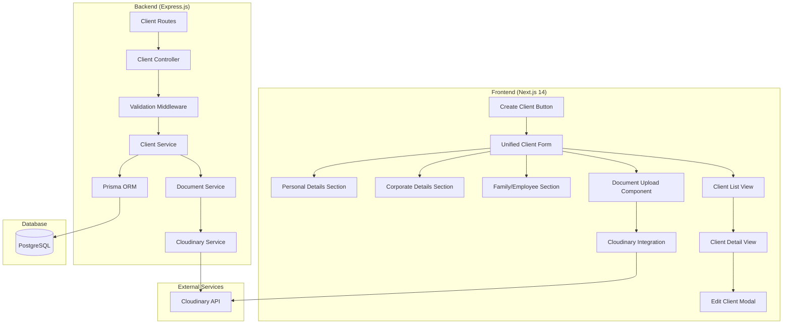

# Design Document

## Overview

The Enhanced Client Management System is a comprehensive client data collection and management solution that uses a single unified form containing all possible client fields. Users can fill in only the information that is relevant to their specific client, whether individual, family member, employee, or corporate entity. The system integrates with Cloudinary for secure document and image storage, provides extensive data validation, and ensures all client information remains editable throughout the client lifecycle.

The design follows a unified form architecture with intelligent field organization, centralized validation logic, and a flexible data model that accommodates any combination of client information while maintaining data integrity and performance.

## Architecture

### System Architecture



### Technology Stack

- **Frontend**: Next.js 14 with App Router, TypeScript, Tailwind CSS, ShadCN UI
- **Backend**: Express.js with TypeScript
- **Database**: PostgreSQL with Prisma ORM
- **File Storage**: Cloudinary for documents and images
- **Validation**: Zod for schema validation
- **Forms**: React Hook Form with Zod resolver
- **UI Components**: ShadCN UI with custom form components

## Components and Interfaces

### Frontend Component Structure

```
/app/dashboard/clients/
├── page.tsx                           # Client list with search and filtering
├── create/
│   └── page.tsx                      # Unified client creation form
├── [id]/
│   ├── page.tsx                      # Client detail view
│   └── edit/page.tsx                 # Edit client form (same unified form)
└── components/
    ├── UnifiedClientForm.tsx         # Single comprehensive client form
    ├── PersonalDetailsSection.tsx    # Personal information fields
    ├── CorporateDetailsSection.tsx   # Corporate information fields
    ├── FamilyEmployeeSection.tsx     # Family/employee specific fields
    ├── DocumentUpload.tsx            # Document upload component
    ├── ProfileImageUpload.tsx        # Profile image upload
    ├── ClientCard.tsx                # Client list item
    ├── ClientFilters.tsx             # Search and filtering
    └── ValidationDisplay.tsx         # Form validation messages

/components/forms/
├── FormField.tsx                     # Reusable form field wrapper
├── DatePicker.tsx                    # Enhanced date picker
├── PhoneInput.tsx                    # Phone number input with validation
├── StateSelector.tsx                 # State dropdown component
├── CitySelector.tsx                  # City dropdown (dependent on state)
├── RelationshipSelector.tsx          # Relationship type selector
├── FileUploadZone.tsx               # Drag-and-drop file upload
└── FormSection.tsx                   # Collapsible form sections

/hooks/
├── useCloudinaryUpload.ts           # Cloudinary upload hook
├── useClientValidation.ts           # Client form validation
├── useFormPersistence.ts            # Form state persistence
└── useUnifiedForm.ts                # Unified form state management
```

### Backend API Structure

```
/src/routes/
├── clients.ts                       # Client CRUD operations
├── documents.ts                     # Document management
└── upload.ts                        # File upload endpoints

/src/controllers/
├── clientController.ts              # Client business logic
├── documentController.ts            # Document operations
└── uploadController.ts              # File upload handling

/src/services/
├── clientService.ts                 # Client data operations
├── documentService.ts               # Document management
├── cloudinaryService.ts             # Cloudinary integration
├── validationService.ts             # Data validation utilities
└── auditService.ts                  # Change tracking

/src/middleware/
├── clientValidation.ts              # Client form validation
├── fileUpload.ts                    # File upload middleware
└── documentSecurity.ts              # Document access control

/src/types/
├── client.ts                        # Client type definitions
├── document.ts                      # Document type definitions
└── validation.ts                    # Validation schemas
```

## Data Models

### Enhanced Database Schema

```prisma
// Unified client model with all possible fields
model Client {
  id              String            @id @default(uuid())
  
  // Mandatory fields (always required)
  firstName       String            // Mandatory
  lastName        String            // Mandatory  
  dateOfBirth     DateTime          // Mandatory (DOB)
  phoneNumber     String            // Mandatory
  whatsappNumber  String            // Mandatory
  
  // Optional personal fields
  middleName      String?
  email           String?
  state           String?
  city            String?
  address         String?
  birthPlace      String?
  age             Int?              // Calculated from DOB
  gender          Gender?
  height          Float?            // In feet
  weight          Float?            // In kg
  education       String?
  maritalStatus   MaritalStatus?
  businessJob     String?
  nameOfBusiness  String?
  typeOfDuty      String?
  annualIncome    Float?
  panNumber       String?
  gstNumber       String?
  
  // Optional corporate fields
  companyName     String?
  
  // Optional family/employee fields  
  relationship    Relationship?
  
  // System fields
  createdAt       DateTime          @default(now())
  updatedAt       DateTime          @updatedAt
  
  // Documents and images
  documents       Document[]
  profileImage    String?           // Cloudinary URL
  
  // Audit trail
  auditLogs       AuditLog[]
  
  @@index([email])
  @@index([phoneNumber])
  @@index([companyName])
  @@index([firstName, lastName])
}

model Document {
  id              String      @id @default(uuid())
  client          Client      @relation(fields: [clientId], references: [id], onDelete: Cascade)
  clientId        String
  
  documentType    DocumentType
  fileName        String
  originalName    String
  cloudinaryUrl   String
  cloudinaryId    String      // For deletion
  fileSize        Int
  mimeType        String
  uploadedAt      DateTime    @default(now())
  
  @@index([clientId])
}

model AuditLog {
  id              String   @id @default(uuid())
  client          Client   @relation(fields: [clientId], references: [id], onDelete: Cascade)
  clientId        String
  
  action          String   // CREATE, UPDATE, DELETE
  fieldName       String?
  oldValue        String?
  newValue        String?
  changedAt       DateTime @default(now())
  
  @@index([clientId])
  @@index([changedAt])
}

// Enums (ClientType removed since we use unified approach)

enum Gender {
  MALE
  FEMALE
  OTHER
}

enum MaritalStatus {
  SINGLE
  MARRIED
  DIVORCED
  WIDOWED
}

enum Relationship {
  SPOUSE
  CHILD
  PARENT
  SIBLING
  EMPLOYEE
  DEPENDENT
  OTHER
}

enum DocumentType {
  IDENTITY_PROOF
  ADDRESS_PROOF
  INCOME_PROOF
  MEDICAL_REPORT
  POLICY_DOCUMENT
  OTHER
}
```

### TypeScript Interfaces

```typescript
// Unified client interface containing all possible fields
interface UnifiedClient {
  id: string;
  
  // Mandatory fields
  firstName: string;
  lastName: string;
  dateOfBirth: Date;
  phoneNumber: string;
  whatsappNumber: string;
  
  // Optional personal fields
  middleName?: string;
  email?: string;
  state?: string;
  city?: string;
  address?: string;
  birthPlace?: string;
  age?: number;                 // Calculated from dateOfBirth
  gender?: Gender;
  height?: number;              // In feet
  weight?: number;              // In kg
  education?: string;
  maritalStatus?: MaritalStatus;
  businessJob?: string;
  nameOfBusiness?: string;
  typeOfDuty?: string;
  annualIncome?: number;
  panNumber?: string;
  gstNumber?: string;
  
  // Optional corporate fields
  companyName?: string;
  
  // Optional family/employee fields
  relationship?: Relationship;
  
  // System fields
  profileImage?: string;
  documents: Document[];
  createdAt: Date;
  updatedAt: Date;
}

// Document interface
interface Document {
  id: string;
  documentType: DocumentType;
  fileName: string;
  originalName: string;
  cloudinaryUrl: string;
  cloudinaryId: string;
  fileSize: number;
  mimeType: string;
  uploadedAt: Date;
}

// Unified form validation schema
interface UnifiedClientFormData {
  // Mandatory fields
  firstName: string;
  lastName: string;
  dateOfBirth: string;          // String for form input, converted to Date
  phoneNumber: string;
  whatsappNumber: string;
  
  // Optional fields (all can be empty)
  middleName?: string;
  email?: string;
  state?: string;
  city?: string;
  address?: string;
  birthPlace?: string;
  gender?: Gender;
  height?: number;
  weight?: number;
  education?: string;
  maritalStatus?: MaritalStatus;
  businessJob?: string;
  nameOfBusiness?: string;
  typeOfDuty?: string;
  annualIncome?: number;
  panNumber?: string;
  gstNumber?: string;
  companyName?: string;
  relationship?: Relationship;
}

// Cloudinary configuration
interface CloudinaryConfig {
  cloudName: string;
  apiKey: string;
  apiSecret: string;
  uploadPreset: string;
  folder: string;
}
```

## Error Handling

### Frontend Error Handling

1. **Form Validation Errors**
   - Real-time validation using Zod schemas
   - Field-level error display with ShadCN Alert components
   - Form submission prevention until all errors are resolved

2. **File Upload Errors**
   - File size validation (max 10MB per file)
   - File type validation (images: jpg, png, gif; documents: pdf, doc, docx)
   - Network error handling with retry functionality
   - Progress indicators for large file uploads

3. **API Error Handling**
   - Standardized error response handling
   - Toast notifications for success/error feedback
   - Loading states during API operations
   - Graceful degradation for offline scenarios

4. **Cloudinary Integration Errors**
   - Upload failure handling with retry mechanism
   - Invalid file format error messages
   - Quota exceeded error handling
   - Network timeout handling

### Backend Error Handling

1. **Validation Errors**
```typescript
interface ValidationError {
  field: string;
  message: string;
  code: string;
}

interface ErrorResponse {
  success: false;
  message: string;
  errors?: ValidationError[];
  statusCode: number;
}
```

2. **File Upload Errors**
   - File size limit enforcement
   - MIME type validation
   - Cloudinary API error handling
   - Storage quota management

3. **Database Errors**
   - Unique constraint violation handling
   - Foreign key constraint errors
   - Connection timeout and retry logic
   - Transaction rollback on failures

## Testing Strategy

### Frontend Testing

1. **Component Tests**
   - Form component rendering and interaction
   - File upload component functionality
   - Validation message display
   - Form section collapsing/expanding

2. **Integration Tests**
   - Form submission workflows
   - File upload to Cloudinary
   - Client CRUD operations
   - Search and filtering functionality

3. **E2E Tests**
   - Complete client creation workflows
   - Document upload and management
   - Client editing and updates
   - Mobile responsiveness

### Backend Testing

1. **Unit Tests**
   - Validation service functions
   - Cloudinary service integration
   - Client service business logic
   - Audit logging functionality

2. **Integration Tests**
   - API endpoint testing
   - Database operations
   - File upload workflows
   - Error handling scenarios

3. **Performance Tests**
   - Large file upload handling
   - Concurrent user scenarios
   - Database query optimization
   - Memory usage monitoring

## Security Considerations

### Data Protection

1. **Input Validation**
   - Server-side validation for all form inputs
   - SQL injection prevention through Prisma ORM
   - XSS protection through input sanitization
   - File upload security scanning

2. **Document Security**
   - Secure Cloudinary URLs with signed access
   - Document access control based on user permissions
   - Automatic file deletion when clients are removed
   - Virus scanning for uploaded files

3. **PII Protection**
   - Encryption of sensitive fields (PAN, GST numbers)
   - Audit logging for all data access
   - GDPR compliance for data deletion
   - Secure data transmission (HTTPS only)

### Authentication & Authorization

1. **Access Control**
   - Role-based access to client data
   - Session management for file uploads
   - API rate limiting for upload endpoints
   - Secure token handling for Cloudinary

## Performance Optimization

### Frontend Performance

1. **Form Optimization**
   - Debounced validation for real-time feedback
   - Lazy loading of form sections
   - Optimistic updates for better UX
   - Form state persistence across sessions

2. **File Upload Optimization**
   - Chunked upload for large files
   - Progress indicators and cancellation
   - Image compression before upload
   - Thumbnail generation for preview

3. **Data Loading**
   - Pagination for client lists
   - Virtual scrolling for large datasets
   - Caching of frequently accessed data
   - Optimistic updates for edits

### Backend Performance

1. **Database Optimization**
   - Proper indexing on search fields
   - Query optimization for client searches
   - Connection pooling for concurrent requests
   - Efficient joins for client details

2. **File Handling**
   - Asynchronous file processing
   - Background thumbnail generation
   - Cleanup jobs for orphaned files
   - CDN integration for file delivery

## Cloudinary Integration

### Configuration

```typescript
// Cloudinary service configuration
const cloudinaryConfig = {
  cloud_name: process.env.CLOUDINARY_CLOUD_NAME,
  api_key: process.env.CLOUDINARY_API_KEY,
  api_secret: process.env.CLOUDINARY_API_SECRET,
  secure: true,
  folder: 'client-documents',
  resource_type: 'auto',
  allowed_formats: ['jpg', 'png', 'gif', 'pdf', 'doc', 'docx'],
  max_file_size: 10485760, // 10MB
};
```

### Upload Strategy

1. **Direct Upload from Frontend**
   - Signed upload URLs for security
   - Upload presets for consistent processing
   - Real-time progress tracking
   - Error handling and retry logic

2. **File Organization**
   - Folder structure: `/clients/{clientId}/{documentType}/`
   - Automatic file naming with timestamps
   - Metadata storage for search functionality
   - Automatic backup and versioning

3. **Image Processing**
   - Automatic thumbnail generation
   - Image optimization for web delivery
   - Format conversion for compatibility
   - Responsive image delivery

## Mobile Responsiveness

### Design Principles

1. **Mobile-First Approach**
   - Touch-friendly form controls
   - Optimized input types for mobile keyboards
   - Swipe gestures for navigation
   - Offline form completion support

2. **Responsive Layouts**
   - Collapsible form sections
   - Adaptive grid layouts
   - Mobile-optimized file upload
   - Touch-friendly buttons and controls

3. **Performance on Mobile**
   - Lazy loading of form sections
   - Compressed image delivery
   - Minimal JavaScript bundles
   - Progressive web app features

## Deployment Architecture

### Environment Configuration

```typescript
// Environment variables
interface EnvironmentConfig {
  // Database
  DATABASE_URL: string;
  
  // Cloudinary
  CLOUDINARY_CLOUD_NAME: string;
  CLOUDINARY_API_KEY: string;
  CLOUDINARY_API_SECRET: string;
  CLOUDINARY_UPLOAD_PRESET: string;
  
  // Application
  JWT_SECRET: string;
  API_BASE_URL: string;
  FRONTEND_URL: string;
  
  // File Upload
  MAX_FILE_SIZE: string;
  ALLOWED_FILE_TYPES: string;
}
```

### Production Considerations

1. **Scalability**
   - Horizontal scaling for API servers
   - Database read replicas for performance
   - CDN integration for file delivery
   - Load balancing for high availability

2. **Monitoring**
   - File upload success/failure rates
   - Cloudinary usage and quota monitoring
   - Database performance metrics
   - User activity and error tracking

3. **Backup Strategy**
   - Regular database backups
   - Cloudinary asset backup
   - Configuration backup
   - Disaster recovery procedures