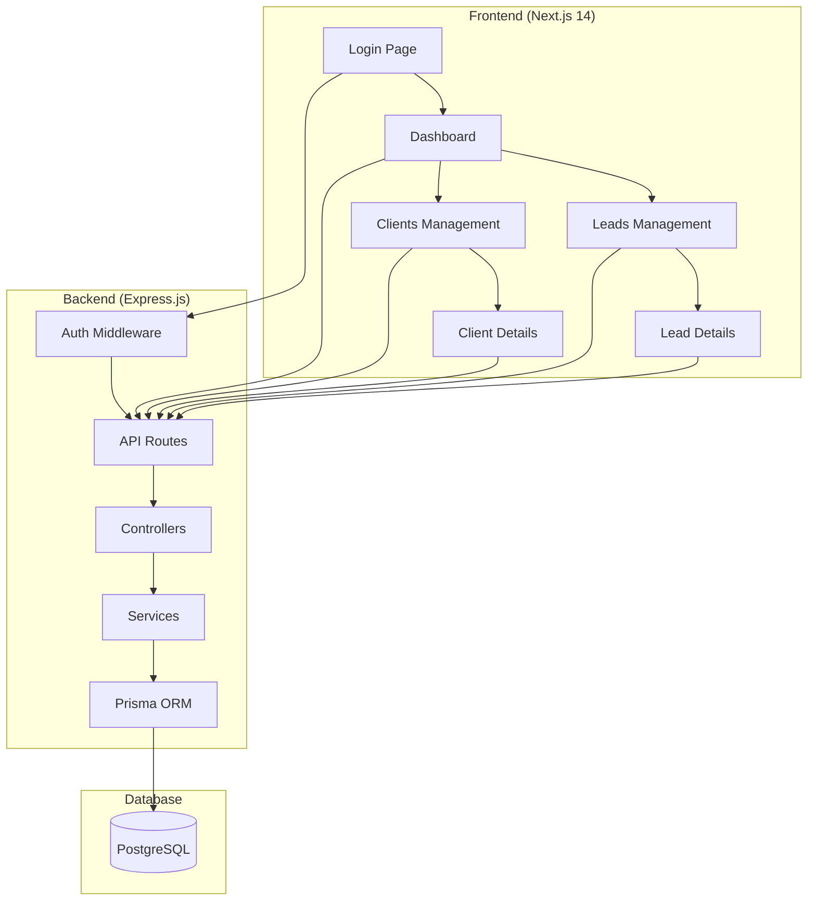

# Design Document

## Overview

The Insurance CRM MVP is a single-user web application built with a modern tech stack focusing on simplicity and core functionality. The system follows a traditional client-server architecture with a React-based frontend (Next.js) and a REST API backend (Express.js) connected to a PostgreSQL database.

The design prioritizes user experience with a clean, responsive interface while maintaining data integrity and security through proper validation and authentication mechanisms.

## Architecture

### System Architecture



### Technology Stack

- **Frontend**: Next.js 14 with App Router, TypeScript, Tailwind CSS, ShadCN UI
- **Backend**: Express.js with TypeScript
- **Database**: PostgreSQL with Prisma ORM
- **Authentication**: JWT tokens with bcrypt password hashing
- **Charts**: Recharts library for dashboard visualizations
- **State Management**: React hooks and context for authentication state

## Components and Interfaces

### Frontend Component Structure

```
/app
├── globals.css                 # Global styles and Tailwind imports
├── layout.tsx                  # Root layout with providers
├── page.tsx                    # Redirect to login or dashboard
├── login/
│   └── page.tsx               # Login form component
└── dashboard/
    ├── layout.tsx             # Protected layout with sidebar/header
    ├── page.tsx               # Dashboard with stats and charts
    ├── leads/
    │   ├── page.tsx           # Leads list with table and modals
    │   └── [id]/page.tsx      # Individual lead detail page
    └── clients/
        ├── page.tsx           # Clients list with table and modals
        └── [id]/page.tsx      # Individual client detail page

/components
├── ui/                        # ShadCN UI components
├── layout/
│   ├── Sidebar.tsx           # Navigation sidebar
│   ├── Header.tsx            # Page header with title/logout
│   └── ProtectedRoute.tsx    # Authentication wrapper
├── dashboard/
│   ├── StatsCards.tsx        # Four statistics cards
│   ├── LeadsChart.tsx        # Bar chart for leads by status
│   └── RecentActivities.tsx  # Activities list component
├── leads/
│   ├── LeadsTable.tsx        # Leads data table
│   ├── LeadModal.tsx         # Add/edit lead modal
│   └── LeadDetail.tsx        # Lead detail view
├── clients/
│   ├── ClientsTable.tsx      # Clients data table
│   ├── ClientModal.tsx       # Add/edit client modal
│   └── ClientDetail.tsx      # Client detail view
└── common/
    ├── SearchInput.tsx       # Reusable search component
    ├── StatusBadge.tsx       # Status/priority badges
    └── ConfirmDialog.tsx     # Delete confirmation dialog
```

### Backend API Structure

```
/src
├── app.ts                     # Express app configuration
├── server.ts                  # Server startup
├── middleware/
│   ├── auth.ts               # JWT authentication middleware
│   ├── validation.ts         # Request validation middleware
│   └── errorHandler.ts       # Global error handling
├── routes/
│   ├── auth.ts               # Authentication routes
│   ├── dashboard.ts          # Dashboard data routes
│   ├── leads.ts              # Leads CRUD routes
│   ├── clients.ts            # Clients CRUD routes
│   └── policies.ts           # Policies read-only routes
├── controllers/
│   ├── authController.ts     # Authentication logic
│   ├── dashboardController.ts # Dashboard statistics
│   ├── leadsController.ts    # Leads business logic
│   ├── clientsController.ts  # Clients business logic
│   └── policiesController.ts # Policies read operations
├── services/
│   ├── authService.ts        # JWT and password utilities
│   ├── activityService.ts    # Activity logging service
│   └── statsService.ts       # Dashboard statistics calculations
├── types/
│   └── index.ts              # TypeScript type definitions
└── prisma/
    ├── schema.prisma         # Database schema
    ├── migrations/           # Database migrations
    └── seed.ts               # Sample data seeding
```

## Data Models

### Database Schema (Prisma)

```prisma
// Authentication and settings
model Settings {
  id            String   @id @default(uuid())
  passwordHash  String
  agentName     String   @default("Agent")
  agentEmail    String   @default("agent@example.com")
  updatedAt     DateTime @updatedAt
}

// Lead management
model Lead {
  id                String   @id @default(uuid())
  name              String
  email             String
  phone             String
  insuranceInterest String   // Life, Health, Auto, Home, Business
  status            String   @default("New") // New, Contacted, Qualified, Won, Lost
  priority          String   @default("Warm") // Hot, Warm, Cold
  notes             String?
  createdAt         DateTime @default(now())
  updatedAt         DateTime @updatedAt
}

// Client management
model Client {
  id          String    @id @default(uuid())
  name        String
  email       String    @unique
  phone       String
  dateOfBirth DateTime
  address     String?
  policies    Policy[]
  createdAt   DateTime  @default(now())
  updatedAt   DateTime  @updatedAt
}

// Policy tracking
model Policy {
  id               String   @id @default(uuid())
  policyNumber     String   @unique
  policyType       String   // Life, Health, Auto, Home, Business
  provider         String
  premiumAmount    Float
  status           String   @default("Active") // Active, Expired
  startDate        DateTime
  expiryDate       DateTime
  commissionAmount Float
  client           Client   @relation(fields: [clientId], references: [id], onDelete: Cascade)
  clientId         String
  createdAt        DateTime @default(now())
  updatedAt        DateTime @updatedAt
}

// Activity logging
model Activity {
  id          String   @id @default(uuid())
  action      String   // Action type identifier
  description String   // Human-readable description
  createdAt   DateTime @default(now())
}
```

### TypeScript Interfaces

```typescript
// Authentication
interface LoginCredentials {
  email: string;
  password: string;
}

interface AuthResponse {
  success: boolean;
  token?: string;
  message?: string;
}

// Dashboard
interface DashboardStats {
  totalLeads: number;
  totalClients: number;
  activePolices: number;
  commissionThisMonth: number;
  leadsChange: number;
  clientsChange: number;
  policiesChange: number;
  commissionChange: number;
}

interface ChartData {
  status: string;
  count: number;
}

// Leads
interface Lead {
  id: string;
  name: string;
  email: string;
  phone: string;
  insuranceInterest: InsuranceType;
  status: LeadStatus;
  priority: Priority;
  notes?: string;
  createdAt: Date;
  updatedAt: Date;
}

type LeadStatus = 'New' | 'Contacted' | 'Qualified' | 'Won' | 'Lost';
type Priority = 'Hot' | 'Warm' | 'Cold';
type InsuranceType = 'Life' | 'Health' | 'Auto' | 'Home' | 'Business';

// Clients
interface Client {
  id: string;
  name: string;
  email: string;
  phone: string;
  dateOfBirth: Date;
  address?: string;
  policies?: Policy[];
  createdAt: Date;
  updatedAt: Date;
}

// Policies
interface Policy {
  id: string;
  policyNumber: string;
  policyType: InsuranceType;
  provider: string;
  premiumAmount: number;
  status: 'Active' | 'Expired';
  startDate: Date;
  expiryDate: Date;
  commissionAmount: number;
  clientId: string;
  createdAt: Date;
  updatedAt: Date;
}

// Activities
interface Activity {
  id: string;
  action: string;
  description: string;
  createdAt: Date;
}
```

## Error Handling

### Frontend Error Handling

1. **Form Validation Errors**
   - Display inline validation messages using ShadCN Alert components
   - Real-time validation for email format and required fields
   - Phone number format validation (10 digits)

2. **API Error Responses**
   - Toast notifications for success/error feedback
   - Loading states with skeleton components during API calls
   - Graceful handling of network timeouts

3. **Route Protection**
   - Automatic redirect to login for unauthenticated users
   - Token expiration handling with automatic logout

4. **Error Boundaries**
   - React error boundaries for component-level error catching
   - Fallback UI for unexpected errors

### Backend Error Handling

1. **Standardized Error Response Format**
```typescript
interface ErrorResponse {
  success: false;
  message: string;
  errors?: ValidationError[];
  statusCode: number;
}
```

2. **Validation Middleware**
   - Request body validation using Zod schemas
   - Parameter validation for route handlers
   - File upload size and type restrictions

3. **Database Error Handling**
   - Prisma error mapping to user-friendly messages
   - Unique constraint violation handling
   - Connection timeout and retry logic

4. **Authentication Errors**
   - Invalid token handling
   - Expired token detection
   - Rate limiting for login attempts

## Testing Strategy

### Frontend Testing

1. **Unit Tests**
   - Component rendering tests using React Testing Library
   - Form validation logic testing
   - Utility function tests for date formatting, calculations

2. **Integration Tests**
   - API integration tests with mock responses
   - User flow tests for critical paths (login, lead creation, conversion)
   - Form submission and validation workflows

3. **E2E Tests (Optional for MVP)**
   - Complete user journeys using Playwright
   - Cross-browser compatibility testing
   - Mobile responsiveness validation

### Backend Testing

1. **Unit Tests**
   - Controller function tests with mocked dependencies
   - Service layer business logic tests
   - Utility function tests (JWT, password hashing)

2. **Integration Tests**
   - API endpoint tests with test database
   - Database operation tests
   - Authentication middleware tests

3. **API Tests**
   - Request/response validation
   - Error handling verification
   - Performance benchmarking for critical endpoints

### Database Testing

1. **Migration Tests**
   - Schema migration validation
   - Data integrity during migrations
   - Rollback procedure verification

2. **Seed Data Tests**
   - Sample data creation validation
   - Relationship integrity verification
   - Performance with larger datasets

## Security Considerations

### Authentication Security

1. **Password Security**
   - Bcrypt hashing with salt rounds (minimum 10)
   - Environment variable storage for credentials
   - JWT secret key rotation capability

2. **Token Management**
   - Short-lived JWT tokens (24 hours)
   - Secure HTTP-only cookie storage (future enhancement)
   - Token blacklisting for logout

### Data Protection

1. **Input Validation**
   - SQL injection prevention through Prisma ORM
   - XSS protection through input sanitization
   - CSRF protection for state-changing operations

2. **API Security**
   - CORS configuration for allowed origins
   - Rate limiting on authentication endpoints
   - Request size limits

### Database Security

1. **Connection Security**
   - Encrypted database connections
   - Principle of least privilege for database user
   - Regular security updates for dependencies

2. **Data Privacy**
   - PII data handling compliance
   - Audit logging for sensitive operations
   - Data retention policies

## Performance Optimization

### Frontend Performance

1. **Code Splitting**
   - Route-based code splitting with Next.js
   - Component lazy loading for modals
   - Image optimization with Next.js Image component

2. **Caching Strategy**
   - Browser caching for static assets
   - API response caching for dashboard statistics
   - Local storage for user preferences

### Backend Performance

1. **Database Optimization**
   - Proper indexing on frequently queried fields
   - Connection pooling for database connections
   - Query optimization for dashboard statistics

2. **API Optimization**
   - Response compression (gzip)
   - Pagination for large datasets
   - Efficient data serialization

## Deployment Architecture

### Development Environment
- Local PostgreSQL database
- Next.js development server (port 3000)
- Express.js development server (port 5000)
- Hot reloading for both frontend and backend

### Production Considerations (Future)
- Docker containerization for consistent deployments
- Environment-specific configuration management
- Database migration automation
- Health check endpoints for monitoring
- Logging and monitoring integration