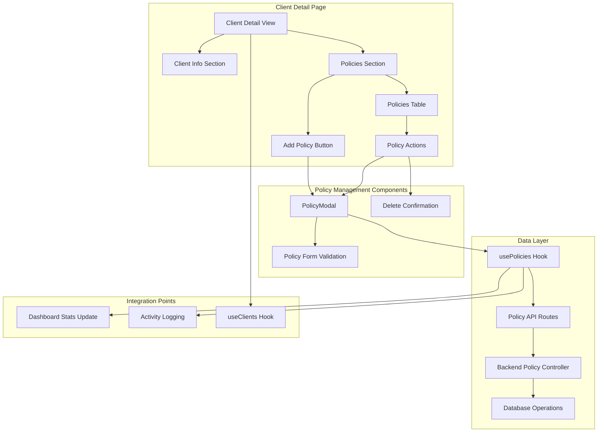

# Design Document

## Overview

The Policy Management feature extends the existing Insurance CRM MVP to provide comprehensive policy management capabilities. This feature enables insurance agents to add, edit, and manage insurance policies for their clients directly from the client detail pages. The design follows the established patterns in the existing codebase, maintaining consistency with the current modal-based forms, validation patterns, and API structure.

The policy management system integrates seamlessly with the existing client management workflow and dashboard statistics, providing a complete view of each client's insurance portfolio while maintaining data integrity and user experience standards.

## Architecture

### Component Integration



### Data Flow Architecture

The policy management system follows the established patterns:

1. **Frontend Components**: React components using ShadCN UI library
2. **State Management**: Custom hooks for data fetching and state management
3. **API Layer**: Next.js API routes acting as proxy to backend
4. **Backend Services**: Express.js controllers and services
5. **Database**: PostgreSQL with Prisma ORM

## Components and Interfaces

### Frontend Component Structure

```
/components/policies/
├── PolicyModal.tsx           # Add/Edit policy modal component
├── PoliciesTable.tsx         # Policies display table
├── PolicyRow.tsx             # Individual policy row with actions
└── PolicyStatusBadge.tsx     # Status indicator component

/hooks/
├── usePolicies.ts           # Policy data management hook
└── usePolicyValidation.ts   # Policy form validation logic

/app/dashboard/clients/[id]/
└── page.tsx                 # Client detail page with policies section
```

### New API Routes

```
/app/api/policies/
├── route.ts                 # GET /api/policies (list policies)
└── [id]/
    └── route.ts            # PUT, DELETE /api/policies/[id]

/app/api/clients/[id]/policies/
└── route.ts                # POST /api/clients/[id]/policies
```

### Backend Extensions

```
/src/routes/
└── policies.ts             # Policy CRUD operations

/src/controllers/
└── policiesController.ts   # Policy business logic

/src/services/
├── policyService.ts        # Policy operations and validation
└── statsService.ts         # Updated to include policy statistics
```

## Data Models

### Enhanced TypeScript Interfaces

```typescript
// Policy Management Types
export interface CreatePolicyRequest {
  policyNumber: string;
  policyType: InsuranceType;
  provider: string;
  premiumAmount: number;
  startDate: string;
  expiryDate: string;
  commissionAmount: number;
}

export interface UpdatePolicyRequest extends Partial<CreatePolicyRequest> {
  status?: 'Active' | 'Expired';
}

export interface PolicyWithClient extends Policy {
  client: {
    id: string;
    name: string;
    email: string;
  };
}

// Enhanced Client Interface
export interface ClientWithPolicies extends Client {
  policies: Policy[];
  totalPolicies: number;
  activePolicies: number;
  totalPremium: number;
  totalCommission: number;
}

// Policy Statistics
export interface PolicyStats {
  totalPolicies: number;
  activePolicies: number;
  expiredPolicies: number;
  totalPremium: number;
  totalCommission: number;
  policiesByType: Record<InsuranceType, number>;
  expiringPolicies: Policy[]; // Expiring within 30 days
}
```

### Database Schema Extensions

The existing Policy model in Prisma schema already supports the required fields. No schema changes needed:

```prisma
model Policy {
  id               String   @id @default(uuid())
  policyNumber     String   @unique
  policyType       String   // Life, Health, Auto, Home, Business
  provider         String
  premiumAmount    Float
  status           String   @default("Active") // Active, Expired
  startDate        DateTime
  expiryDate       DateTime
  commissionAmount Float
  client           Client   @relation(fields: [clientId], references: [id], onDelete: Cascade)
  clientId         String
  createdAt        DateTime @default(now())
  updatedAt        DateTime @updatedAt
}
```

## Component Design Specifications

### PolicyModal Component

**Purpose**: Add/Edit policy modal following existing modal patterns

**Key Features**:
- Form validation with inline error messages
- Date picker components for start/expiry dates
- Currency input formatting for premium and commission
- Provider dropdown or text input
- Policy type selection matching InsuranceType enum
- Auto-generated policy numbers with validation for uniqueness

**Validation Rules**:
- Policy number: Required, unique across all policies
- Premium amount: Required, positive number, max 2 decimal places
- Commission amount: Required, positive number, max 2 decimal places
- Start date: Required, cannot be more than 1 year in the future
- Expiry date: Required, must be after start date
- Provider: Required, max 100 characters
- Policy type: Required, must match InsuranceType enum

### PoliciesTable Component

**Purpose**: Display client policies in a responsive table format

**Columns**:
- Policy Number (with link to expand details)
- Type (with icon indicators)
- Provider
- Premium (formatted currency)
- Status (badge component)
- Start Date (formatted)
- Expiry Date (formatted, with warning for near expiry)
- Commission (formatted currency)
- Actions (Edit, Delete buttons)

**Features**:
- Responsive design with mobile-friendly layout
- Sort by expiry date, premium amount, or creation date
- Status badges with color coding (Active: green, Expired: red)
- Warning indicators for policies expiring within 30 days
- Empty state when no policies exist

### Client Detail Page Enhancement

**New Policies Section**:
- Header with "Policies" title and "Add Policy" button
- Summary cards showing total policies, active policies, total premium
- PoliciesTable component
- Empty state with call-to-action to add first policy

**Integration Points**:
- Breadcrumb navigation: Dashboard > Clients > [Client Name]
- Page title updates to include client name
- Loading states during policy operations
- Toast notifications for policy actions

## API Design

### Policy Management Endpoints

```typescript
// GET /api/policies?clientId=xxx&status=Active
interface GetPoliciesResponse {
  success: boolean;
  data: {
    policies: Policy[];
    pagination: PaginationInfo;
    stats: PolicyStats;
  };
}

// POST /api/clients/[id]/policies
interface CreatePolicyResponse {
  success: boolean;
  data: Policy;
  message: string;
}

// PUT /api/policies/[id]
interface UpdatePolicyResponse {
  success: boolean;
  data: Policy;
  message: string;
}

// DELETE /api/policies/[id]
interface DeletePolicyResponse {
  success: boolean;
  message: string;
}
```

### Error Handling

**Validation Errors**:
- Duplicate policy number: "Policy number already exists"
- Invalid date range: "Expiry date must be after start date"
- Invalid amounts: "Premium and commission must be positive numbers"

**Business Logic Errors**:
- Policy not found: "Policy not found or access denied"
- Client not found: "Client not found"
- Cannot delete policy with claims: "Cannot delete policy with active claims"

## User Experience Flow

### Adding a Policy

1. **Entry Point**: Client detail page > "Add Policy" button
2. **Modal Opens**: PolicyModal with empty form
3. **Form Completion**: User fills required fields with real-time validation
4. **Submission**: Form validates, API call creates policy
5. **Success**: Modal closes, table refreshes, success toast shown
6. **Activity Log**: "Added new policy: [Policy Number] for [Client Name]"

### Editing a Policy

1. **Entry Point**: Policy table row > "Edit" button
2. **Modal Opens**: PolicyModal with pre-filled data
3. **Form Updates**: User modifies fields with validation
4. **Submission**: Changes validated and saved
5. **Success**: Modal closes, table updates, success toast shown
6. **Activity Log**: "Updated policy: [Policy Number] for [Client Name]"

### Deleting a Policy

1. **Entry Point**: Policy table row > "Delete" button
2. **Confirmation**: Dialog shows policy details and confirms deletion
3. **Confirmation**: User confirms or cancels
4. **Deletion**: If confirmed, policy removed from database
5. **Success**: Table refreshes, success toast shown
6. **Activity Log**: "Deleted policy: [Policy Number] for [Client Name]"

## Integration with Existing Features

### Dashboard Statistics Updates

**Real-time Updates**: Policy operations trigger dashboard statistics recalculation
- Total Active Policies count
- Total Commission This Month calculation
- Policy-related percentage changes

**Implementation**: 
- usePolicies hook triggers dashboard refresh on policy changes
- Backend statsService includes policy calculations
- Dashboard components subscribe to policy change events

### Activity Logging Integration

**Policy Activities**: All policy operations logged to Activity table
- Create: "Added new policy: [Policy Number] for [Client Name]"
- Update: "Updated policy: [Policy Number] for [Client Name]"
- Delete: "Deleted policy: [Policy Number] for [Client Name]"
- Status Change: "Policy [Policy Number] status changed to [Status]"

**Implementation**: Backend policy operations call activityService.logActivity()

### Client Management Integration

**Enhanced Client Views**: Client detail pages show policy summaries
**Lead Conversion**: When converting leads to clients, option to immediately add first policy
**Client Statistics**: Client cards show policy counts and total premium values

## Error Handling Strategy

### Frontend Error Handling

**Form Validation**:
- Real-time validation with debounced API calls for uniqueness checks
- Inline error messages using existing error styling patterns
- Form submission disabled until all validation passes

**API Error Responses**:
- Network errors: "Unable to connect. Please check your connection."
- Validation errors: Display specific field errors inline
- Server errors: "Something went wrong. Please try again."

**Loading States**:
- Modal form submission: Button shows "Saving..." with spinner
- Table operations: Row-level loading indicators
- Page navigation: Skeleton components during data loading

### Backend Error Handling

**Validation Middleware**:
- Zod schemas for request validation
- Custom validation for business rules (date ranges, uniqueness)
- Standardized error response format

**Database Error Handling**:
- Unique constraint violations mapped to user-friendly messages
- Foreign key constraint errors handled gracefully
- Transaction rollback on complex operations

## Testing Strategy

### Frontend Testing

**Component Tests**:
- PolicyModal form validation and submission
- PoliciesTable rendering and interactions
- Policy status badge display logic
- Client detail page policy section integration

**Integration Tests**:
- Policy CRUD operations with mock API responses
- Form validation workflows
- Error handling scenarios
- Loading state management

**E2E Tests**:
- Complete policy management user journeys
- Policy creation from client detail page
- Policy editing and deletion workflows
- Dashboard statistics updates after policy operations

### Backend Testing

**Unit Tests**:
- Policy controller CRUD operations
- Policy validation logic
- Statistics calculation accuracy
- Activity logging functionality

**Integration Tests**:
- Policy API endpoints with test database
- Database constraint validation
- Authentication and authorization
- Error response formatting

**API Tests**:
- Request/response validation
- Error handling verification
- Performance benchmarking
- Data integrity validation

## Security Considerations

### Data Validation

**Input Sanitization**:
- All policy data validated and sanitized
- SQL injection prevention through Prisma ORM
- XSS protection for policy provider names and notes

**Business Rule Validation**:
- Policy number uniqueness enforced at database level
- Date range validation prevents invalid policy periods
- Amount validation ensures positive values only

### Access Control

**Authentication**:
- All policy endpoints require valid JWT token
- Policy operations limited to authenticated agent only
- Session timeout handling for long-form interactions

**Authorization**:
- Agents can only manage policies for their own clients
- Policy deletion requires confirmation to prevent accidental loss
- Audit trail maintained for all policy operations

## Performance Optimization

### Frontend Performance

**Component Optimization**:
- Lazy loading of PolicyModal component
- Memoized policy calculations and formatting
- Efficient table rendering with virtualization for large policy lists
- Debounced search and validation API calls

**Caching Strategy**:
- Policy data cached in React state with smart invalidation
- Dashboard statistics cached with policy change triggers
- Form validation results cached to prevent duplicate API calls

### Backend Performance

**Database Optimization**:
- Indexes on policyNumber, clientId, and expiryDate fields
- Efficient queries for policy statistics calculations
- Batch operations for multiple policy updates
- Connection pooling for concurrent policy operations

**API Optimization**:
- Pagination for large policy lists
- Selective field loading based on use case
- Response compression for policy data
- Efficient JSON serialization

## Deployment Considerations

### Database Migrations

**Schema Updates**: No schema changes required - existing Policy model sufficient
**Data Migration**: No existing data migration needed for new feature
**Index Creation**: Add performance indexes for policy queries

### Feature Rollout

**Progressive Enhancement**: Policy management can be deployed without affecting existing functionality
**Feature Flags**: Optional feature flag for policy management during initial rollout
**Monitoring**: Track policy operation performance and error rates
**Rollback Plan**: Feature can be disabled without data loss if issues arise