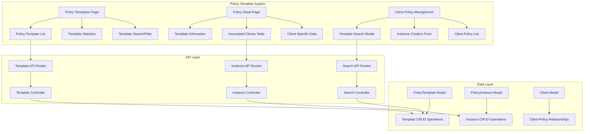
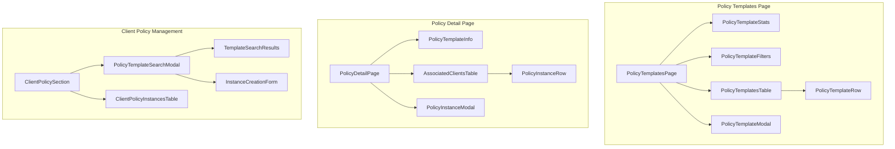

# Design Document

## Overview

The Policy Template System introduces a fundamental architectural change to policy management in the Insurance Agent CRM. This system separates policy templates (master policy information) from policy instances (client-specific policy data), enabling a more flexible and scalable approach to policy management. The design leverages the existing database schema that already includes PolicyTemplate and PolicyInstance models, providing a clean separation of concerns between policy products and client-specific policy details.

This system addresses the core requirement of displaying policy templates without client-specific data on the policies page, while providing detailed client-specific information when viewing individual policy templates. It also streamlines the process of adding policies to clients by allowing them to search and select from existing policy templates.

## Architecture

### System Architecture Overview



### Component Hierarchy



## Data Models

### Enhanced TypeScript Interfaces

```typescript
// Policy Template Types
export interface PolicyTemplate {
  id: string;
  policyNumber: string;
  policyType: InsuranceType;
  provider: string;
  description?: string;
  createdAt: string;
  updatedAt: string;
  instanceCount?: number; // Computed field
  activeInstanceCount?: number; // Computed field
}

export interface CreatePolicyTemplateRequest {
  policyNumber: string;
  policyType: InsuranceType;
  provider: string;
  description?: string;
}

export interface UpdatePolicyTemplateRequest extends Partial<CreatePolicyTemplateRequest> {}

// Policy Instance Types
export interface PolicyInstance {
  id: string;
  policyTemplateId: string;
  clientId: string;
  premiumAmount: number;
  status: 'Active' | 'Expired';
  startDate: string;
  expiryDate: string;
  commissionAmount: number;
  createdAt: string;
  updatedAt: string;
}

export interface PolicyInstanceWithClient extends PolicyInstance {
  client: {
    id: string;
    name: string;
    email: string;
  };
}

export interface PolicyInstanceWithTemplate extends PolicyInstance {
  policyTemplate: {
    id: string;
    policyNumber: string;
    policyType: InsuranceType;
    provider: string;
  };
}

export interface CreatePolicyInstanceRequest {
  policyTemplateId: string;
  clientId: string;
  premiumAmount: number;
  startDate: string;
  durationMonths: number; // Will calculate expiryDate
  commissionAmount: number;
}

export interface UpdatePolicyInstanceRequest extends Partial<CreatePolicyInstanceRequest> {
  status?: 'Active' | 'Expired';
  expiryDate?: string; // Allow direct expiry date updates
}

// Search and Filter Types
export interface PolicyTemplateFilters {
  search?: string;
  policyTypes?: InsuranceType[];
  providers?: string[];
  hasInstances?: boolean;
}

export interface PolicyTemplateSearchResult {
  id: string;
  policyNumber: string;
  policyType: InsuranceType;
  provider: string;
  description?: string;
  instanceCount: number;
}

// Statistics Types
export interface PolicyTemplateStats {
  totalTemplates: number;
  totalInstances: number;
  activeInstances: number;
  totalClients: number;
  topProviders: Array<{
    provider: string;
    templateCount: number;
    instanceCount: number;
  }>;
  policyTypeDistribution: Array<{
    type: InsuranceType;
    templateCount: number;
    instanceCount: number;
  }>;
}

export interface PolicyDetailStats {
  totalClients: number;
  activeInstances: number;
  expiredInstances: number;
  totalPremium: number;
  totalCommission: number;
  averagePremium: number;
  expiringThisMonth: number;
}
```

### Database Schema Utilization

The existing Prisma schema already includes the required models:

```prisma
// Policy Template - Master policy information
model PolicyTemplate {
  id           String            @id @default(uuid())
  policyNumber String            @unique
  policyType   String
  provider     String
  description  String?
  createdAt    DateTime          @default(now())
  updatedAt    DateTime          @updatedAt
  instances    PolicyInstance[]
}

// Policy Instance - Client-specific policy details
model PolicyInstance {
  id               String          @id @default(uuid())
  policyTemplateId String
  clientId         String
  premiumAmount    Float
  status           String          @default("Active")
  startDate        DateTime
  expiryDate       DateTime
  commissionAmount Float
  createdAt        DateTime        @default(now())
  updatedAt        DateTime        @updatedAt
  
  policyTemplate   PolicyTemplate  @relation(fields: [policyTemplateId], references: [id], onDelete: Cascade)
  client           Client          @relation(fields: [clientId], references: [id], onDelete: Cascade)
  
  @@unique([policyTemplateId, clientId])
}
```

## Component Design Specifications

### PolicyTemplatesPage Component

**Purpose**: Main page displaying policy templates without client-specific data

**Layout Structure**:
```tsx
<div className="space-y-6">
  {/* Page Header */}
  <div className="flex justify-between items-center">
    <div>
      <h1 className="text-2xl font-bold">Policy Templates</h1>
      <p className="text-gray-600">Manage your insurance policy templates</p>
    </div>
    <Button onClick={openCreateModal}>Add Policy Template</Button>
  </div>
  
  {/* Statistics Cards */}
  <PolicyTemplateStats stats={stats} loading={statsLoading} />
  
  {/* Search and Filters */}
  <PolicyTemplateFilters 
    filters={filters}
    onFiltersChange={handleFiltersChange}
    availableProviders={availableProviders}
  />
  
  {/* Templates Table */}
  <PolicyTemplatesTable 
    templates={templates}
    loading={loading}
    onEdit={handleEdit}
    onDelete={handleDelete}
    onViewDetails={handleViewDetails}
  />
  
  {/* Pagination */}
  <Pagination 
    currentPage={pagination.page}
    totalPages={pagination.totalPages}
    onPageChange={handlePageChange}
  />
</div>
```

**Key Features**:
- Clean template-focused interface
- No client-specific data displayed
- Instance count indicators
- Direct navigation to policy detail pages

### PolicyTemplatesTable Component

**Purpose**: Display policy templates in a clean, template-focused table

**Column Structure**:
- Policy Number (clickable, navigates to detail page)
- Policy Type (with icon indicators)
- Provider
- Description (truncated with tooltip)
- Clients (count of associated clients)
- Active Instances (count with status indicator)
- Created Date
- Actions (Edit, Delete, View Details)

**Implementation**:
```tsx
<Table>
  <TableHeader>
    <TableRow>
      <TableHead>Policy Number</TableHead>
      <TableHead>Type</TableHead>
      <TableHead>Provider</TableHead>
      <TableHead>Description</TableHead>
      <TableHead>Clients</TableHead>
      <TableHead>Active</TableHead>
      <TableHead>Created</TableHead>
      <TableHead>Actions</TableHead>
    </TableRow>
  </TableHeader>
  <TableBody>
    {templates.map((template) => (
      <TableRow key={template.id}>
        <TableCell>
          <Button 
            variant="link" 
            onClick={() => navigateToDetail(template.id)}
            className="font-medium"
          >
            {template.policyNumber}
          </Button>
        </TableCell>
        <TableCell>
          <div className="flex items-center gap-2">
            <PolicyTypeIcon type={template.policyType} />
            {template.policyType}
          </div>
        </TableCell>
        <TableCell>{template.provider}</TableCell>
        <TableCell>
          <TooltipProvider>
            <Tooltip>
              <TooltipTrigger>
                <span className="truncate max-w-[200px] block">
                  {template.description || 'No description'}
                </span>
              </TooltipTrigger>
              <TooltipContent>
                {template.description || 'No description available'}
              </TooltipContent>
            </Tooltip>
          </TooltipProvider>
        </TableCell>
        <TableCell>
          <Badge variant="secondary">
            {template.instanceCount || 0}
          </Badge>
        </TableCell>
        <TableCell>
          <Badge variant={template.activeInstanceCount > 0 ? "default" : "secondary"}>
            {template.activeInstanceCount || 0}
          </Badge>
        </TableCell>
        <TableCell>{formatDate(template.createdAt)}</TableCell>
        <TableCell>
          <DropdownMenu>
            <DropdownMenuTrigger asChild>
              <Button variant="ghost" size="sm">
                <MoreHorizontal className="h-4 w-4" />
              </Button>
            </DropdownMenuTrigger>
            <DropdownMenuContent>
              <DropdownMenuItem onClick={() => handleEdit(template)}>
                Edit Template
              </DropdownMenuItem>
              <DropdownMenuItem onClick={() => navigateToDetail(template.id)}>
                View Details
              </DropdownMenuItem>
              <DropdownMenuItem 
                onClick={() => handleDelete(template)}
                className="text-red-600"
              >
                Delete Template
              </DropdownMenuItem>
            </DropdownMenuContent>
          </DropdownMenu>
        </TableCell>
      </TableRow>
    ))}
  </TableBody>
</Table>
```

### PolicyDetailPage Component

**Purpose**: Display policy template details with all associated clients and their specific data

**Layout Structure**:
```tsx
<div className="space-y-6">
  {/* Breadcrumb Navigation */}
  <Breadcrumb>
    <BreadcrumbItem>
      <Link href="/dashboard/policies">Policy Templates</Link>
    </BreadcrumbItem>
    <BreadcrumbItem>{template.policyNumber}</BreadcrumbItem>
  </Breadcrumb>
  
  {/* Policy Template Information */}
  <Card>
    <CardHeader>
      <div className="flex justify-between items-start">
        <div>
          <CardTitle className="flex items-center gap-2">
            <PolicyTypeIcon type={template.policyType} />
            {template.policyNumber}
          </CardTitle>
          <CardDescription>
            {template.policyType} • {template.provider}
          </CardDescription>
        </div>
        <div className="flex gap-2">
          <Button variant="outline" onClick={handleEditTemplate}>
            Edit Template
          </Button>
          <Button onClick={openAddClientModal}>
            Add Client
          </Button>
        </div>
      </div>
    </CardHeader>
    <CardContent>
      <p className="text-gray-700">
        {template.description || 'No description available'}
      </p>
    </CardContent>
  </Card>
  
  {/* Policy Statistics */}
  <PolicyDetailStats stats={detailStats} loading={statsLoading} />
  
  {/* Associated Clients Table */}
  <Card>
    <CardHeader>
      <CardTitle>Associated Clients</CardTitle>
      <CardDescription>
        Clients who have this policy with their specific details
      </CardDescription>
    </CardHeader>
    <CardContent>
      <AssociatedClientsTable 
        instances={instances}
        loading={instancesLoading}
        onEditInstance={handleEditInstance}
        onDeleteInstance={handleDeleteInstance}
        onClientClick={handleClientClick}
      />
    </CardContent>
  </Card>
</div>
```

### AssociatedClientsTable Component

**Purpose**: Display all clients associated with a policy template with their specific policy data

**Column Structure**:
- Client Name (clickable, navigates to client detail)
- Email
- Start Date
- Expiry Date (with warning indicators)
- Duration (calculated from dates)
- Premium Amount (formatted currency)
- Commission Amount (formatted currency)
- Status (badge with color coding)
- Actions (Edit Instance, Delete Instance)

**Implementation**:
```tsx
<Table>
  <TableHeader>
    <TableRow>
      <TableHead>Client</TableHead>
      <TableHead>Email</TableHead>
      <TableHead>Start Date</TableHead>
      <TableHead>Expiry Date</TableHead>
      <TableHead>Premium</TableHead>
      <TableHead>Commission</TableHead>
      <TableHead>Status</TableHead>
      <TableHead>Actions</TableHead>
    </TableRow>
  </TableHeader>
  <TableBody>
    {instances.map((instance) => (
      <TableRow key={instance.id}>
        <TableCell>
          <Button 
            variant="link" 
            onClick={() => navigateToClient(instance.client.id)}
            className="font-medium"
          >
            {instance.client.name}
          </Button>
        </TableCell>
        <TableCell className="text-gray-600">
          {instance.client.email}
        </TableCell>
        <TableCell>{formatDate(instance.startDate)}</TableCell>
        <TableCell>
          <div className="flex items-center gap-2">
            {formatDate(instance.expiryDate)}
            {isExpiringSoon(instance.expiryDate) && (
              <AlertTriangle className="h-4 w-4 text-amber-500" />
            )}
          </div>
        </TableCell>
        <TableCell>{formatCurrency(instance.premiumAmount)}</TableCell>
        <TableCell>{formatCurrency(instance.commissionAmount)}</TableCell>
        <TableCell>
          <Badge variant={instance.status === 'Active' ? 'default' : 'secondary'}>
            {instance.status}
          </Badge>
        </TableCell>
        <TableCell>
          <div className="flex gap-1">
            <Button 
              variant="ghost" 
              size="sm"
              onClick={() => handleEditInstance(instance)}
            >
              <Edit className="h-4 w-4" />
            </Button>
            <Button 
              variant="ghost" 
              size="sm"
              onClick={() => handleDeleteInstance(instance)}
            >
              <Trash className="h-4 w-4" />
            </Button>
          </div>
        </TableCell>
      </TableRow>
    ))}
  </TableBody>
</Table>
```

### PolicyTemplateSearchModal Component

**Purpose**: Search and select policy templates when adding policies to clients

**Key Features**:
- Real-time search by policy number and provider
- Policy template results with basic information
- Instance creation form after template selection
- Duration-based expiry date calculation

**Implementation**:
```tsx
<Dialog open={isOpen} onOpenChange={setIsOpen}>
  <DialogContent className="max-w-4xl">
    <DialogHeader>
      <DialogTitle>Add Policy to {clientName}</DialogTitle>
      <DialogDescription>
        Search for a policy template and specify client-specific details
      </DialogDescription>
    </DialogHeader>
    
    {!selectedTemplate ? (
      // Template Search Phase
      <div className="space-y-4">
        <div className="flex gap-4">
          <Input
            placeholder="Search by policy number or provider..."
            value={searchQuery}
            onChange={(e) => setSearchQuery(e.target.value)}
            className="flex-1"
          />
          <Button onClick={handleSearch}>Search</Button>
        </div>
        
        {searchResults.length > 0 && (
          <div className="space-y-2 max-h-60 overflow-y-auto">
            {searchResults.map((template) => (
              <Card 
                key={template.id}
                className="cursor-pointer hover:bg-gray-50"
                onClick={() => setSelectedTemplate(template)}
              >
                <CardContent className="p-4">
                  <div className="flex justify-between items-start">
                    <div>
                      <h4 className="font-medium">{template.policyNumber}</h4>
                      <p className="text-sm text-gray-600">
                        {template.policyType} • {template.provider}
                      </p>
                      {template.description && (
                        <p className="text-sm text-gray-500 mt-1">
                          {template.description}
                        </p>
                      )}
                    </div>
                    <Badge variant="secondary">
                      {template.instanceCount} clients
                    </Badge>
                  </div>
                </CardContent>
              </Card>
            ))}
          </div>
        )}
      </div>
    ) : (
      // Instance Creation Phase
      <div className="space-y-4">
        <Card>
          <CardContent className="p-4">
            <div className="flex justify-between items-start">
              <div>
                <h4 className="font-medium">{selectedTemplate.policyNumber}</h4>
                <p className="text-sm text-gray-600">
                  {selectedTemplate.policyType} • {selectedTemplate.provider}
                </p>
              </div>
              <Button 
                variant="ghost" 
                size="sm"
                onClick={() => setSelectedTemplate(null)}
              >
                Change Policy
              </Button>
            </div>
          </CardContent>
        </Card>
        
        <form onSubmit={handleSubmit} className="space-y-4">
          <div className="grid grid-cols-2 gap-4">
            <div>
              <Label htmlFor="startDate">Start Date *</Label>
              <Input
                id="startDate"
                type="date"
                value={formData.startDate}
                onChange={(e) => setFormData({...formData, startDate: e.target.value})}
                required
              />
            </div>
            <div>
              <Label htmlFor="duration">Duration *</Label>
              <Select
                value={formData.durationMonths.toString()}
                onValueChange={(value) => setFormData({...formData, durationMonths: parseInt(value)})}
              >
                <SelectTrigger>
                  <SelectValue placeholder="Select duration" />
                </SelectTrigger>
                <SelectContent>
                  <SelectItem value="6">6 months</SelectItem>
                  <SelectItem value="12">1 year</SelectItem>
                  <SelectItem value="24">2 years</SelectItem>
                  <SelectItem value="36">3 years</SelectItem>
                </SelectContent>
              </Select>
            </div>
          </div>
          
          <div className="grid grid-cols-2 gap-4">
            <div>
              <Label htmlFor="premium">Premium Amount *</Label>
              <Input
                id="premium"
                type="number"
                step="0.01"
                min="0"
                value={formData.premiumAmount}
                onChange={(e) => setFormData({...formData, premiumAmount: parseFloat(e.target.value)})}
                required
              />
            </div>
            <div>
              <Label htmlFor="commission">Commission Amount *</Label>
              <Input
                id="commission"
                type="number"
                step="0.01"
                min="0"
                value={formData.commissionAmount}
                onChange={(e) => setFormData({...formData, commissionAmount: parseFloat(e.target.value)})}
                required
              />
            </div>
          </div>
          
          {calculatedExpiryDate && (
            <div className="p-3 bg-blue-50 rounded-lg">
              <p className="text-sm text-blue-800">
                <strong>Calculated Expiry Date:</strong> {formatDate(calculatedExpiryDate)}
              </p>
            </div>
          )}
          
          <div className="flex justify-end gap-2">
            <Button type="button" variant="outline" onClick={() => setIsOpen(false)}>
              Cancel
            </Button>
            <Button type="submit" disabled={isSubmitting}>
              {isSubmitting ? 'Adding Policy...' : 'Add Policy'}
            </Button>
          </div>
        </form>
      )}
    )}
  </DialogContent>
</Dialog>
```

## API Design

### Policy Template Endpoints

```typescript
// GET /api/policy-templates
interface GetPolicyTemplatesRequest {
  page?: number;
  limit?: number;
  search?: string;
  policyTypes?: string[];
  providers?: string[];
  hasInstances?: boolean;
}

interface GetPolicyTemplatesResponse {
  success: boolean;
  data: {
    templates: PolicyTemplate[];
    pagination: PaginationInfo;
    stats: PolicyTemplateStats;
    filters: {
      availableProviders: string[];
      availablePolicyTypes: InsuranceType[];
    };
  };
}

// POST /api/policy-templates
interface CreatePolicyTemplateRequest {
  policyNumber: string;
  policyType: InsuranceType;
  provider: string;
  description?: string;
}

interface CreatePolicyTemplateResponse {
  success: boolean;
  data: PolicyTemplate;
  message: string;
}

// GET /api/policy-templates/[id]
interface GetPolicyTemplateResponse {
  success: boolean;
  data: {
    template: PolicyTemplate;
    instances: PolicyInstanceWithClient[];
    stats: PolicyDetailStats;
  };
}

// PUT /api/policy-templates/[id]
interface UpdatePolicyTemplateResponse {
  success: boolean;
  data: PolicyTemplate;
  message: string;
}

// DELETE /api/policy-templates/[id]
interface DeletePolicyTemplateResponse {
  success: boolean;
  message: string;
  affectedClients: number;
}
```

### Policy Template Search Endpoints

```typescript
// GET /api/policy-templates/search
interface SearchPolicyTemplatesRequest {
  query: string;
  limit?: number;
  excludeClientId?: string; // Exclude templates already associated with client
}

interface SearchPolicyTemplatesResponse {
  success: boolean;
  data: PolicyTemplateSearchResult[];
}
```

### Policy Instance Endpoints

```typescript
// POST /api/clients/[id]/policy-instances
interface CreatePolicyInstanceRequest {
  policyTemplateId: string;
  premiumAmount: number;
  startDate: string;
  durationMonths: number;
  commissionAmount: number;
}

interface CreatePolicyInstanceResponse {
  success: boolean;
  data: PolicyInstanceWithTemplate;
  message: string;
}

// PUT /api/policy-instances/[id]
interface UpdatePolicyInstanceRequest {
  premiumAmount?: number;
  startDate?: string;
  durationMonths?: number;
  expiryDate?: string;
  commissionAmount?: number;
  status?: 'Active' | 'Expired';
}

interface UpdatePolicyInstanceResponse {
  success: boolean;
  data: PolicyInstanceWithTemplate;
  message: string;
}

// DELETE /api/policy-instances/[id]
interface DeletePolicyInstanceResponse {
  success: boolean;
  message: string;
}

// GET /api/policy-templates/[id]/clients
interface GetPolicyTemplateClientsResponse {
  success: boolean;
  data: {
    instances: PolicyInstanceWithClient[];
    stats: PolicyDetailStats;
  };
}
```

## Backend Service Design

### PolicyTemplateService

```typescript
class PolicyTemplateService {
  async getTemplatesWithFilters(
    filters: PolicyTemplateFilters,
    pagination: PaginationOptions
  ): Promise<{
    templates: PolicyTemplate[];
    stats: PolicyTemplateStats;
    pagination: PaginationInfo;
  }> {
    // Query templates with instance counts
    // Calculate statistics
    // Apply filters and pagination
  }

  async createTemplate(
    data: CreatePolicyTemplateRequest
  ): Promise<PolicyTemplate> {
    // Validate policy number uniqueness
    // Create template record
    // Log activity
  }

  async updateTemplate(
    id: string,
    data: UpdatePolicyTemplateRequest
  ): Promise<PolicyTemplate> {
    // Validate changes
    // Update template
    // Log activity
  }

  async deleteTemplate(id: string): Promise<{
    success: boolean;
    affectedClients: number;
  }> {
    // Check for associated instances
    // Delete template and cascade instances
    // Update statistics
    // Log activity
  }

  async searchTemplates(
    query: string,
    excludeClientId?: string
  ): Promise<PolicyTemplateSearchResult[]> {
    // Search by policy number and provider
    // Exclude templates already associated with client
    // Return with instance counts
  }
}
```

### PolicyInstanceService

```typescript
class PolicyInstanceService {
  async createInstance(
    clientId: string,
    data: CreatePolicyInstanceRequest
  ): Promise<PolicyInstanceWithTemplate> {
    // Validate template exists
    // Check for duplicate client-template association
    // Calculate expiry date from duration
    // Create instance
    // Update statistics
    // Log activity
  }

  async updateInstance(
    id: string,
    data: UpdatePolicyInstanceRequest
  ): Promise<PolicyInstanceWithTemplate> {
    // Validate changes
    // Recalculate expiry date if needed
    // Update instance
    // Update statistics
    // Log activity
  }

  async deleteInstance(id: string): Promise<void> {
    // Delete instance
    // Update statistics
    // Log activity
  }

  async getInstancesByTemplate(
    templateId: string
  ): Promise<{
    instances: PolicyInstanceWithClient[];
    stats: PolicyDetailStats;
  }> {
    // Get all instances for template
    // Calculate template-specific statistics
  }

  async getInstancesByClient(
    clientId: string
  ): Promise<PolicyInstanceWithTemplate[]> {
    // Get all instances for client
    // Include template information
  }
}
```

## User Experience Flows

### Policy Template Management Flow

1. **Template Discovery**: User navigates to /dashboard/policies
2. **Template View**: Clean list of policy templates without client data
3. **Template Details**: Click on template to see all associated clients
4. **Template Creation**: Add new policy templates for future use
5. **Template Editing**: Update template information (affects all instances)

### Client Policy Addition Flow

1. **Client Context**: User is on client detail page
2. **Add Policy**: Click "Add Policy" button
3. **Template Search**: Search modal opens with template search
4. **Template Selection**: User finds and selects appropriate template
5. **Instance Details**: Form appears for client-specific details
6. **Duration Calculation**: System calculates expiry date from duration
7. **Instance Creation**: Policy instance created and linked to client

### Policy Detail Management Flow

1. **Template Detail**: User views policy template detail page
2. **Client Overview**: See all clients with this policy template
3. **Instance Management**: Edit or delete specific client instances
4. **Client Navigation**: Click client name to view full client details
5. **Statistics View**: See template-specific performance metrics

## Integration Points

### Dashboard Integration

**Statistics Updates**:
- Policy instance operations update dashboard metrics
- Template creation affects policy portfolio statistics
- Instance expiry tracking for dashboard alerts

**Activity Logging**:
- Template operations: "Created policy template: [Policy Number]"
- Instance operations: "Added policy [Policy Number] to client [Client Name]"
- Template updates: "Updated policy template: [Policy Number]"

### Client Management Integration

**Enhanced Client Views**:
- Client detail pages show policy instances with template information
- Policy addition through template search modal
- Client statistics include policy instance data

**Navigation Enhancement**:
- Breadcrumb navigation between clients, policies, and templates
- Cross-linking between related entities
- Context-aware navigation flows

### Existing Policy Migration

**Backward Compatibility**:
- Existing Policy model remains for transition period
- Migration utility to convert existing policies to template system
- Gradual rollout with feature flags

## Error Handling Strategy

### Template Management Errors

**Validation Errors**:
- Duplicate policy number: "Policy number already exists"
- Invalid policy type: "Please select a valid policy type"
- Missing required fields: Field-specific error messages

**Business Logic Errors**:
- Template deletion with instances: "Cannot delete template with active instances"
- Template not found: "Policy template not found"
- Unauthorized access: "Access denied to policy template"

### Instance Management Errors

**Validation Errors**:
- Duplicate client association: "Client already has this policy"
- Invalid date ranges: "Start date must be before expiry date"
- Invalid amounts: "Premium and commission must be positive"

**Business Logic Errors**:
- Template not found: "Selected policy template no longer exists"
- Client not found: "Client not found or access denied"
- Instance not found: "Policy instance not found"

## Performance Optimization

### Database Optimization

**Indexing Strategy**:
- Composite index on (policyTemplateId, clientId) for instances
- Index on policyNumber for template searches
- Index on provider for filtering
- Index on expiryDate for expiry tracking

**Query Optimization**:
- Efficient joins for template-instance relationships
- Aggregation queries for statistics calculation
- Pagination with cursor-based approach for large datasets

### Frontend Optimization

**Component Performance**:
- Memoized template and instance calculations
- Lazy loading of policy detail pages
- Virtual scrolling for large template lists
- Debounced search inputs

**Caching Strategy**:
- Template data cached with smart invalidation
- Search results cached for common queries
- Statistics cached with periodic refresh

## Security Considerations

### Access Control

**Template Access**:
- Agents can only manage their own policy templates
- Template visibility restricted to owning agent
- Audit logging for all template operations

**Instance Access**:
- Agents can only create instances for their own clients
- Instance modifications restricted to owning agent
- Cross-client validation for instance operations

### Data Validation

**Input Sanitization**:
- Policy number format validation
- Provider name sanitization
- Description content filtering
- Amount validation with precision limits

**Business Rule Enforcement**:
- Unique policy numbers across templates
- Valid client-template associations
- Date range validation for instances
- Positive amount validation

## Testing Strategy

### Component Testing

**Template Components**:
- PolicyTemplatesPage rendering and interactions
- PolicyTemplateModal form validation and submission
- PolicyDetailPage data display and navigation
- AssociatedClientsTable sorting and actions

**Instance Components**:
- PolicyTemplateSearchModal search and selection
- Instance creation form validation
- Client policy section integration
- Duration calculation accuracy

### Integration Testing

**API Integration**:
- Template CRUD operations with database
- Instance CRUD operations with relationships
- Search functionality with filters
- Statistics calculation accuracy

**User Flow Testing**:
- Complete template management workflows
- Client policy addition through template search
- Cross-navigation between templates and clients
- Error handling scenarios

### End-to-End Testing

**User Journeys**:
- Template creation and management
- Client policy addition via template search
- Policy detail page navigation and management
- Statistics accuracy across operations

## Deployment Strategy

### Database Migration

**Schema Utilization**:
- PolicyTemplate and PolicyInstance models already exist
- No schema changes required for initial deployment
- Optional: Add indexes for performance optimization

**Data Migration**:
- Optional: Migrate existing Policy records to template system
- Maintain backward compatibility during transition
- Gradual rollout with feature flags

### Feature Rollout

**Progressive Deployment**:
- Deploy template system alongside existing policy management
- Feature flag for template system access
- Gradual user migration from old to new system
- Monitor performance and user adoption

**Rollback Plan**:
- Template system can be disabled without data loss
- Existing policy management remains functional
- Database schema supports both systems simultaneously
- No breaking changes to existing APIs